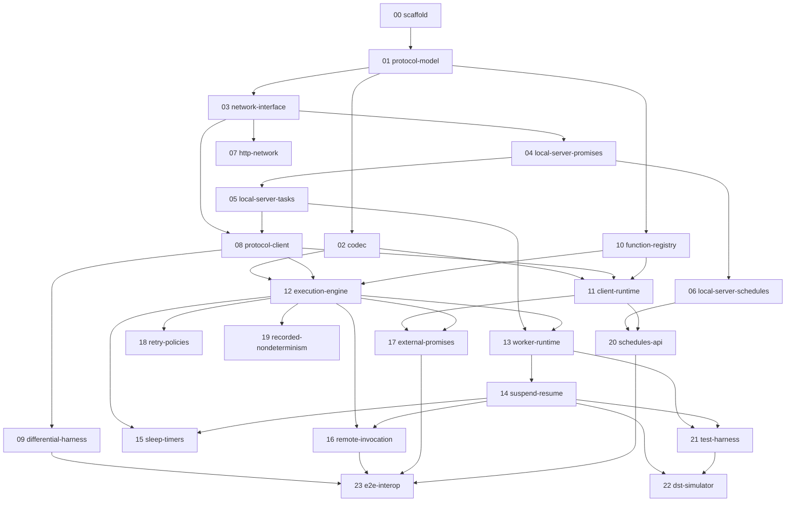

# Implementation Plan — Effect Resonate SDK

> **ENTRY POINT.** This file is the single place an implementation agent starts from.
> The approved design is `docs/DESIGN.md` — it is binding. This plan turns it into
> ordered, parallelizable implementation specs under `docs/plan/specs/`.

## Mission

Implement the Effect-native Resonate SDK per `docs/DESIGN.md`, with 100% protocol
conformance to `repos/resonate-specification`, verified continuously against the
in-repo oracle and the shipped Resonate server.

## How to work this plan (agent loop)

For every work session:

1. **Pick** the lowest-numbered spec in `docs/plan/specs/` whose status in the
   Progress Tracker below is `todo` and whose dependencies are all `done`.
   If several qualify, they are parallel-safe — pick any (or fan out).
2. **Read** the spec file fully, then the referenced sections of `docs/DESIGN.md`,
   the referenced Lean spec files, and the referenced native SDK code. Do not skip
   the references; the spec files point at exact behaviors to replicate.
3. **Tests first** where practical: write the conformance/behavior tests the spec
   lists, watch them fail, then implement.
4. **Implement the smallest slice** that makes the tests pass, Effect-native per
   `repos/effect-smol/LLMS.md` (Effect.gen / Effect.fn / Context.Service / Layer /
   Schema — no ad-hoc validation, no `Date.now`, no raw strings for domain ids).
5. **Verify**: run focused tests while iterating; finish with `vp run check`
   (format, lint, typecheck, test). A slice is not done until `vp run check` passes.
6. **Update** the Progress Tracker table below (status + notes) and tick the
   relevant rows in `docs/plan/CONFORMANCE.md`.
7. **Commit** with a message naming the spec (`feat(05): local server task state machine`).
8. **Summarize** what changed and what the next recommended spec is.

### Decision rules (binding)

- Spec (`repos/resonate-specification`) wins over the native SDK; the **shipped
  server** wins over the spec's prose where they differ (record such cases in
  `CONFORMANCE.md` under Deviations).
- Native SDK behavior wins over invention. **Never change behavior** relative to
  native — deviations are allowed only in API typing/ergonomics (see DESIGN.md
  resolved decisions). Even additive client-side checks count as behavior changes.
- Strict on construct, lenient on decode: never reject a wire record the server
  itself accepts.
- Unsure? Stop, document the question in the spec file's Notes, ask for approval.
- Do not copy non-Effect idioms from the native SDK when an Effect-native design
  preserves protocol adherence.

## Spec index and dependency graph

Specs are indexed in implementation order; the graph defines what can run in parallel.

### Parallel lanes

- After **01**: `02`, `03`, `10` are independent.
- After **03**: the oracle lane (`04 → 05 → 06`), the transport lane (`07`), and
  the client lane (`08`, once 04/05 exist for its tests) proceed in parallel.
- After **12**: `13→14`, `18`, `19` are parallel; `15`/`16` need `14`; `17` needs `11`.
- `09` (differential) runs as soon as `08` lands and stays green from then on.
- `23` is the integration gate at the end.

## Progress tracker

Statuses: `todo` | `in-progress` | `done` | `blocked` (blocked requires a note).

| #   | Spec                                                           | Status | Notes |
| --- | -------------------------------------------------------------- | ------ | ----- |
| 00  | [scaffold](specs/00-scaffold.md)                               | todo   |       |
| 01  | [protocol-model](specs/01-protocol-model.md)                   | todo   |       |
| 02  | [codec](specs/02-codec.md)                                     | todo   |       |
| 03  | [network-interface](specs/03-network-interface.md)             | todo   |       |
| 04  | [local-server-promises](specs/04-local-server-promises.md)     | todo   |       |
| 05  | [local-server-tasks](specs/05-local-server-tasks.md)           | todo   |       |
| 06  | [local-server-schedules](specs/06-local-server-schedules.md)   | todo   |       |
| 07  | [http-network](specs/07-http-network.md)                       | todo   |       |
| 08  | [protocol-client](specs/08-protocol-client.md)                 | todo   |       |
| 09  | [differential-harness](specs/09-differential-harness.md)       | todo   |       |
| 10  | [function-registry](specs/10-function-registry.md)             | todo   |       |
| 11  | [client-runtime](specs/11-client-runtime.md)                   | todo   |       |
| 12  | [execution-engine](specs/12-execution-engine.md)               | todo   |       |
| 13  | [worker-runtime](specs/13-worker-runtime.md)                   | todo   |       |
| 14  | [suspend-resume](specs/14-suspend-resume.md)                   | todo   |       |
| 15  | [sleep-timers](specs/15-sleep-timers.md)                       | todo   |       |
| 16  | [remote-invocation](specs/16-remote-invocation.md)             | todo   |       |
| 17  | [external-promises](specs/17-external-promises.md)             | todo   |       |
| 18  | [retry-policies](specs/18-retry-policies.md)                   | todo   |       |
| 19  | [recorded-nondeterminism](specs/19-recorded-nondeterminism.md) | todo   |       |
| 20  | [schedules-api](specs/20-schedules-api.md)                     | todo   |       |
| 21  | [test-harness](specs/21-test-harness.md)                       | todo   |       |
| 22  | [dst-simulator](specs/22-dst-simulator.md)                     | todo   |       |
| 23  | [e2e-interop](specs/23-e2e-interop.md)                         | todo   |       |

## Protocol conformance tracking

`docs/plan/CONFORMANCE.md` maps every spec action (P-01…P-06, T-01…T-11, S-01…S-04,
resume, timeouts) plus handbook MUSTs to the implementing spec and its tests. Update
it whenever a slice lands. Known spec-vs-shipped-server deviations live there too.

## Translate, don't reinvent — the native→Effect translation map

The native SDK already solves this problem; our job is converting its internals to
Effect modules while holding the wire and semantics fixed. **Every native source file
is assigned to a spec below. Before implementing any component, read its assigned
native source in full** — the spec files point at exact symbols and line ranges, and
several require byte-level wire fixtures captured from the native implementation.
Coverage rule: if you find yourself writing protocol logic with no corresponding row
in this table, stop — you are inventing; find the native counterpart or raise it.

| Native source (`repos/resonate-sdk-ts/src/`)                                    | Spec                                     | Our module                                    |
| ------------------------------------------------------------------------------- | ---------------------------------------- | --------------------------------------------- |
| `network/types.ts` (wire shapes)                                                | 01                                       | `Protocol.ts`                                 |
| `exceptions.ts` (error taxonomy)                                                | 01                                       | `Errors.ts`                                   |
| `codec.ts`, `encryptor.ts`, `util.ts` (base64)                                  | 02                                       | `Codec.ts`                                    |
| `network/network.ts` (Send/Recv seam)                                           | 03                                       | `Network.ts`                                  |
| `network/local.ts` (reference server — promises / tasks / schedules)            | 04 / 05 / 06                             | `NetworkLocal.ts`                             |
| `network/http.ts` (HttpNetwork, PollMessageSource)                              | 07                                       | `NetworkHttp.ts`                              |
| `promises.ts`, `schedules.ts` (raw protocol wrappers)                           | 08                                       | `DurablePromise.ts`, `Task.ts`, `Schedule.ts` |
| `registry.ts`                                                                   | 10                                       | registry in `Resonate.ts`                     |
| `resonate.ts` (run/rpc/begin\*/get/handles/root tags)                           | 11                                       | `ResonateClient`                              |
| `resonate.ts` `schedule()` (:446-478)                                           | 20                                       | `Resonate.schedule`                           |
| `context.ts` (InnerContext: ids/lineage/seq, lfi/lfc)                           | 12                                       | engine + `ResonateContext.ts`                 |
| `context.ts` (rfi/rfc/detached, prefixId/originId)                              | 16                                       | `ctx.rpc/beginRpc/detached`                   |
| `context.ts` (sleep / promise / date.now / math.random / panic)                 | 15 / 17 / 19 / 12                        | `ResonateContext.ts`                          |
| `coroutine.ts`, `computation.ts`, `decorator.ts` (replay driver)                | 12, 14                                   | engine internals                              |
| `core.ts` (executeUntilBlocked, onMessage, suspend/fulfill/release)             | 13, 14                                   | `Worker.ts`                                   |
| `heartbeat.ts` (NOTE: its empty-tasks payload is a known bug — fix per spec 13) | 13                                       | worker heartbeat                              |
| `options.ts`, `util.ts` (splitArgsAndOpts)                                      | 11, 12                                   | options resolution                            |
| `retries.ts`, `util.ts` (executeWithRetry)                                      | 18                                       | `RetryPolicy`                                 |
| `trace.ts` (well-formedness predicates)                                         | 22 (optional)                            | DST trace assertions                          |
| `clock.ts`, `logger.ts`                                                         | n/a — replaced by Effect `Clock`/logging | —                                             |

The Lean spec actions map to specs in `docs/plan/CONFORMANCE.md` (one row per action);
the handbook's normative MUSTs are itemized there too. Between the two tables, full
compliance is enumerable: a spec is done only when its CONFORMANCE.md rows are done.

## Reference material (read before inventing anything)

| Source                                             | Use for                                                    |
| -------------------------------------------------- | ---------------------------------------------------------- |
| `docs/DESIGN.md`                                   | Binding API design and resolved decisions                  |
| `repos/resonate-specification/spec`                | Protocol semantics (Lean abstract machine)                 |
| `repos/resonate-sdk-ts/src`                        | Wire formats, native behavior, `local.ts` reference server |
| `repos/distributed-async-await.io/content/docs`    | Implementation handbook (normative MUSTs, gotchas)         |
| `repos/effect-smol` (`LLMS.md`, `packages/effect`) | Effect v4 APIs and idioms                                  |
| `repos/effect-kafka`, `~/erik/effect-inngest`      | Effect ecosystem API-shape references                      |
