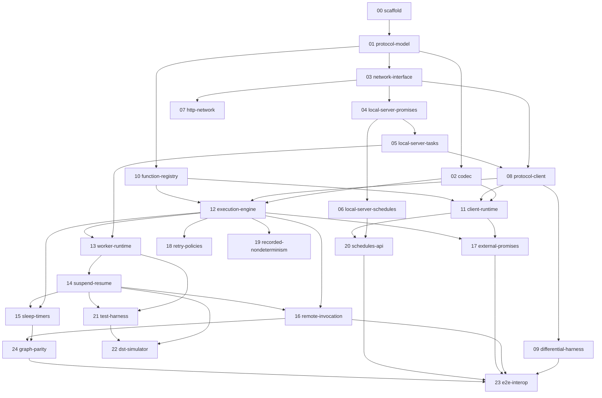

# Implementation Plan — Effect Resonate SDK

> **ENTRY POINT.** This file is the single place an implementation agent starts from.
> The approved design is `docs/DESIGN.md` — it is binding. This plan turns it into
> ordered, parallelizable implementation specs under `docs/plan/specs/`.

## Mission

Implement the Effect-native Resonate SDK per `docs/DESIGN.md`, with 100% protocol
conformance to `repos/resonate-specification`, verified continuously against the
in-repo oracle and the shipped Resonate server.

## Definition of done (the goal, checkable)

1. Every row in the Progress Tracker below is `done`.
2. Every row in `docs/plan/CONFORMANCE.md` is `done` (or explicitly deferred with a
   written reason) — each backed by named tests.
3. `vp run check` is green, including the differential suite (spec 09) against a
   running `resonate dev` server (the CLI is installed locally; the suite boots it
   via a `vp` task and skips LOUDLY — never silently — when unavailable).
4. Spec 23's scenarios pass against the shipped server, including quickstart parity:
   our `Countdown` invoked via `resonate invoke countdown.1 --func Countdown --arg 5
--arg 60`, worker killed mid-countdown and restarted, resumes exactly like the
   native SDK's README demo — plus bidirectional interop with a native TS worker
   (run from `repos/resonate-sdk-ts` source under bun).

Real-server caveat: `TestClock` cannot drive `resonate dev`, so real-server scenarios
use short genuine durations (seconds-scale timeouts/leases); long-horizon time
behavior (week sleeps, schedule catch-up) is proven on the TestClock-driven oracle,
with the differential suite confirming semantics on short horizons.

## How to work this plan (agent loop)

For every work session:

1. **Pick** the lowest-numbered spec in `docs/plan/specs/` whose status in the
   Progress Tracker below is `todo` and whose dependencies are all `done`.
   If several qualify, they are parallel-safe — pick any (or fan out).
2. **Read** the spec file fully, then the referenced sections of `docs/DESIGN.md`,
   the referenced Lean spec files, and the referenced native SDK code. Do not skip
   the references; the spec files point at exact behaviors to replicate. Also read
   `LEARNINGS.md` (repo root) — corrections from past reviews that are binding.
3. **Tests first** where practical: write the conformance/behavior tests the spec
   lists, watch them fail, then implement.
4. **Implement the smallest slice** that makes the tests pass, Effect-native per
   `repos/effect-smol/LLMS.md` (Effect.gen / Effect.fn / Context.Service / Layer /
   Schema — no ad-hoc validation, no `Date.now`, no raw strings for domain ids).
5. **Verify**: run focused tests while iterating; finish with `vp run check`
   (format, lint, typecheck, test). A slice is not done until `vp run check` passes.
6. **Update** the Progress Tracker table below (status + notes) and tick the
   relevant rows in `docs/plan/CONFORMANCE.md`.
7. **Commit** with a message naming the spec (`feat(05): local server task state machine`).
8. **Summarize** what changed and what the next recommended spec is.

### Decision rules (binding)

- Spec (`repos/resonate-specification`) wins over the native SDK; the **shipped
  server** wins over the spec's prose where they differ (record such cases in
  `CONFORMANCE.md` under Deviations).
- Native SDK behavior wins over invention. **Never change behavior** relative to
  native — deviations are allowed only in API typing/ergonomics (see DESIGN.md
  resolved decisions). Even additive client-side checks count as behavior changes.
- Strict on construct, lenient on decode: never reject a wire record the server
  itself accepts.
- Unsure? Stop, document the question in the spec file's Notes, ask for approval.
- Do not copy non-Effect idioms from the native SDK when an Effect-native design
  preserves protocol adherence.

## Spec index and dependency graph

Specs are indexed in implementation order; the graph defines what can run in parallel.

### Parallel lanes

- After **01**: `02`, `03`, `10` are independent.
- After **03**: the oracle lane (`04 → 05 → 06`), the transport lane (`07`), and
  the client lane (`08`, once 04/05 exist for its tests) proceed in parallel.
- After **12**: `13→14`, `18`, `19` are parallel; `15`/`16` need `14`; `17` needs `11`.
- `09` (differential) runs as soon as `08` lands and stays green from then on.
- `24` (graph parity vs native twins) runs once 15/16 land; `23` is the integration gate at the end.

## Progress tracker

Statuses: `todo` | `in-progress` | `done` | `blocked` (blocked requires a note).

| #   | Spec                                                           | Status | Notes                                                                                                                                                                                                                                                                 |
| --- | -------------------------------------------------------------- | ------ | --------------------------------------------------------------------------------------------------------------------------------------------------------------------------------------------------------------------------------------------------------------------- |
| 00  | [scaffold](specs/00-scaffold.md)                               | done   | Module skeleton per DESIGN.md §3, main package export, `it.effect` smoke test; `vp run check` green.                                                                                                                                                                  |
| 01  | [protocol-model](specs/01-protocol-model.md)                   | done   | `Protocol.ts` + `Errors.ts`: branded ids, Tags (lenient wire transform), state-discriminated records with strict/`FromWire` split, all 26 request/response kinds, messages. 71 tests. See spec Notes.                                                                 |
| 02  | [codec](specs/02-codec.md)                                     | done   | `ResonateCodec.layerJson` byte-compatible with native (fixtures captured from `resonate-sdk-ts` under bun); `ResonateEncryptor.layerNoop`; `encodeValue`/`decodeValue` compose the two seams.                                                                         |
| 03  | [network-interface](specs/03-network-interface.md)             | done   | `ResonateNetwork` service + envelope helpers (`makeRequestHead` via `Crypto`, `checkEnvelope`, `decodeResponse`); `TestNetwork` stub in `testing.ts` round-trips responses through the wire schemas.                                                                  |
| 04  | [local-server-promises](specs/04-local-server-promises.md)     | done   | `NetworkLocal.layer`: Lean P-01…P-05 + resume cascade + onPromiseTimeout via three-phase tick; Clock-driven; `debug.snap`/`debug.tick`/`debug.reset` implemented for the oracle. 19 scenario tests.                                                                   |
| 05  | [local-server-tasks](specs/05-local-server-tasks.md)           | done   | `NetworkLocal.layer`: T-01…T-10 + resume buffering + retry/lease task timeouts; `assertInvariants` oracle exported from `testing.ts`; task tests assert invariants via snapshots.                                                                                     |
| 06  | [local-server-schedules](specs/06-local-server-schedules.md)   | done   | `NetworkLocal.layer`: S-01…S-03 + schedule catch-up in `debug.tick`; uses `effect/Cron` with local five-field-only dialect; materialized promises use historical tick time.                                                                                           |
| 07  | [http-network](specs/07-http-network.md)                       | done   | `NetworkHttp.layer`: POST request envelope, typed protocol status responses, auth/transport normalization, Bun-backed SSE poll stream with terminal auth and TestClock-observed reconnect backoff.                                                                    |
| 08  | [protocol-client](specs/08-protocol-client.md)                 | done   | `DurablePromises`, `Tasks`, `Schedules` services over `ResonateNetwork`; typed status mapping incl. `TaskFenced`/`SuspendRefused`; awaitSettled listener/unblock loop.                                                                                                |
| 09  | [differential-harness](specs/09-differential-harness.md)       | done   | `test/Differential.test.ts` runs local-vs-shipped scenarios when `resonate` is installed; otherwise normal checks emit a loud `[DIFFERENTIAL SKIPPED]` marker.                                                                                                        |
| 10  | [function-registry](specs/10-function-registry.md)             | done   | `Resonate.function`/`group` definitions, `Handler` context entries, `toLayer`/`toLayerHandler`, and runtime `Registry` with duplicate rejection and latest-version lookup.                                                                                            |
| 11  | [client-runtime](specs/11-client-runtime.md)                   | done   | `ResonateClient.layer`: begin/run RPC/run handles, root tags, invocation codec path + string-name overloads, await/poll/cancel terminal mapping over layer-2 clients.                                                                                                 |
| 12  | [execution-engine](specs/12-execution-engine.md)               | done   | `ExecutionEngine` + `ResonateContext`: registry dispatch, codec param decode, local `ctx.run`/`beginRun`, deterministic child ids, fenced create/settle, preload replay, root fulfill.                                                                                |
| 13  | [worker-runtime](specs/13-worker-runtime.md)                   | done   | `Worker.layer`: scoped execute-message loop, acquire/drop stale wakeups, registry-before-work, engine dispatch, release on engine failure, held-task heartbeat with real `(id, version)` pairs.                                                                       |
| 14  | [suspend-resume](specs/14-suspend-resume.md)                   | done   | Pending external/timer awaits now surface `Suspended` engine outcomes; worker issues atomic `task.suspend`, clears held leases, and loops on `300 + preload`; worker suspend/resume replay covered.                                                                   |
| 15  | [sleep-timers](specs/15-sleep-timers.md)                       | done   | `ResonateContext.sleep`/`sleepUntil` create `resonate:timer` promises with native lineage/tags; worker suspends on pending timers, replays after timeout resolution, and clamps timers to parent timeout.                                                             |
| 16  | [remote-invocation](specs/16-remote-invocation.md)             | done   | `ctx.beginRpc`/`ctx.rpc`/`ctx.detached`: targeted global children, attached structured-concurrency flush, fan-out suspension, explicit-id lineage breaks, and detached bounded ids/unclamped timeouts.                                                                |
| 17  | [external-promises](specs/17-external-promises.md)             | done   | `Resonate.promise`, `ctx.promise`, declaration-derived ids, client `resolve`/`reject`, typed await decode, malformed-settle defects, duplicate detection, and latent-promise timeouts.                                                                                |
| 18  | [retry-policies](specs/18-retry-policies.md)                   | done   | Native-compatible retry policy math/wire codec, invocation param persistence, local-step retry loop, `ctx.info.attempt`, non-retryable schema matching, and timeout-bound stop.                                                                                       |
| 19  | [recorded-nondeterminism](specs/19-recorded-nondeterminism.md) | done   | `ctx.now` and `ctx.random` execute as local durable steps, record native-compatible epoch-ms/float values, replay from preload, and consume normal sequence-counter ids.                                                                                              |
| 20  | [schedules-api](specs/20-schedules-api.md)                     | done   | `Resonate.schedule` returns an idempotent schedule value with `.create`/`.get`/`.delete`/`.layer`; it emits native templates, static invocation params, target tags, and no drift checks.                                                                             |
| 21  | [test-harness](specs/21-test-harness.md)                       | done   | `test/support/testing.ts` provides `ResonateTest.layer`, `snapshot`, `restartWorker`, and `assertInvariants`; the layer bundles local server, worker, client, codec, protocol services, and handlers.                                                                 |
| 22  | [dst-simulator](specs/22-dst-simulator.md)                     | done   | Seeded DST corpus in `test/DstSimulator.test.ts` drives worker restarts, clock steps, yields/reorder points, protocol-op fuzzing, invariant checks, and exactly-once counters; `vp run dst` added.                                                                    |
| 23  | [e2e-interop](specs/23-e2e-interop.md)                         | done   | Server-gated `test/E2EInterop.test.ts` starts `resonate dev`, invokes through the CLI, restarts our worker mid-countdown, runs both cross-SDK call directions, resolves external promises across SDKs, checks schedules, and asserts `resonate tree`; examples added. |
| 24  | [graph-parity](specs/24-graph-parity.md)                       | done   | Graph parity harness asserts deterministic ids, lineage/scope/timer tags, invocation params, detached ids, and replay graph stability; `resonate tree` is exercised by the E2E gate.                                                                                  |

## Protocol conformance tracking

`docs/plan/CONFORMANCE.md` maps every spec action (P-01…P-06, T-01…T-11, S-01…S-04,
resume, timeouts) plus handbook MUSTs to the implementing spec and its tests. Update
it whenever a slice lands. Known spec-vs-shipped-server deviations live there too.

## Translate, don't reinvent — the native→Effect translation map

The native SDK already solves this problem; our job is converting its internals to
Effect modules while holding the wire and semantics fixed. **Every native source file
is assigned to a spec below. Before implementing any component, read its assigned
native source in full** — the spec files point at exact symbols and line ranges, and
several require byte-level wire fixtures captured from the native implementation.
Coverage rule: if you find yourself writing protocol logic with no corresponding row
in this table, stop — you are inventing; find the native counterpart or raise it.

| Native source (`repos/resonate-sdk-ts/src/`)                                    | Spec                                     | Our module                                    |
| ------------------------------------------------------------------------------- | ---------------------------------------- | --------------------------------------------- |
| `network/types.ts` (wire shapes)                                                | 01                                       | `Protocol.ts`                                 |
| `exceptions.ts` (error taxonomy)                                                | 01                                       | `Errors.ts`                                   |
| `codec.ts`, `encryptor.ts`, `util.ts` (base64)                                  | 02                                       | `Codec.ts`                                    |
| `network/network.ts` (Send/Recv seam)                                           | 03                                       | `Network.ts`                                  |
| `network/local.ts` (reference server — promises / tasks / schedules)            | 04 / 05 / 06                             | `NetworkLocal.ts`                             |
| `network/http.ts` (HttpNetwork, PollMessageSource)                              | 07                                       | `NetworkHttp.ts`                              |
| `promises.ts`, `schedules.ts` (raw protocol wrappers)                           | 08                                       | `DurablePromise.ts`, `Task.ts`, `Schedule.ts` |
| `registry.ts`                                                                   | 10                                       | registry in `Resonate.ts`                     |
| `resonate.ts` (run/rpc/begin\*/get/handles/root tags)                           | 11                                       | `ResonateClient`                              |
| `resonate.ts` `schedule()` (:446-478)                                           | 20                                       | `Resonate.schedule`                           |
| `context.ts` (InnerContext: ids/lineage/seq, lfi/lfc)                           | 12                                       | engine + `ResonateContext.ts`                 |
| `context.ts` (rfi/rfc/detached, prefixId/originId)                              | 16                                       | `ctx.rpc/beginRpc/detached`                   |
| `context.ts` (sleep / promise / date.now / math.random / panic)                 | 15 / 17 / 19 / 12                        | `ResonateContext.ts`                          |
| `coroutine.ts`, `computation.ts`, `decorator.ts` (replay driver)                | 12, 14                                   | engine internals                              |
| `core.ts` (executeUntilBlocked, onMessage, suspend/fulfill/release)             | 13, 14                                   | `Worker.ts`                                   |
| `heartbeat.ts` (NOTE: its empty-tasks payload is a known bug — fix per spec 13) | 13                                       | worker heartbeat                              |
| `options.ts`, `util.ts` (splitArgsAndOpts)                                      | 11, 12                                   | options resolution                            |
| `retries.ts`, `util.ts` (executeWithRetry)                                      | 18                                       | `RetryPolicy`                                 |
| `trace.ts` (well-formedness predicates)                                         | 22 (optional)                            | DST trace assertions                          |
| `clock.ts`, `logger.ts`                                                         | n/a — replaced by Effect `Clock`/logging | —                                             |

The Lean spec actions map to specs in `docs/plan/CONFORMANCE.md` (one row per action);
the handbook's normative MUSTs are itemized there too. Between the two tables, full
compliance is enumerable: a spec is done only when its CONFORMANCE.md rows are done.

## Reference material (read before inventing anything)

| Source                                             | Use for                                                    |
| -------------------------------------------------- | ---------------------------------------------------------- |
| `docs/DESIGN.md`                                   | Binding API design and resolved decisions                  |
| `repos/resonate-specification/spec`                | Protocol semantics (Lean abstract machine)                 |
| `repos/resonate-sdk-ts/src`                        | Wire formats, native behavior, `local.ts` reference server |
| `repos/distributed-async-await.io/content/docs`    | Implementation handbook (normative MUSTs, gotchas)         |
| `repos/effect-smol` (`LLMS.md`, `packages/effect`) | Effect v4 APIs and idioms                                  |
| `repos/effect-kafka`, `~/erik/effect-inngest`      | Effect ecosystem API-shape references                      |
